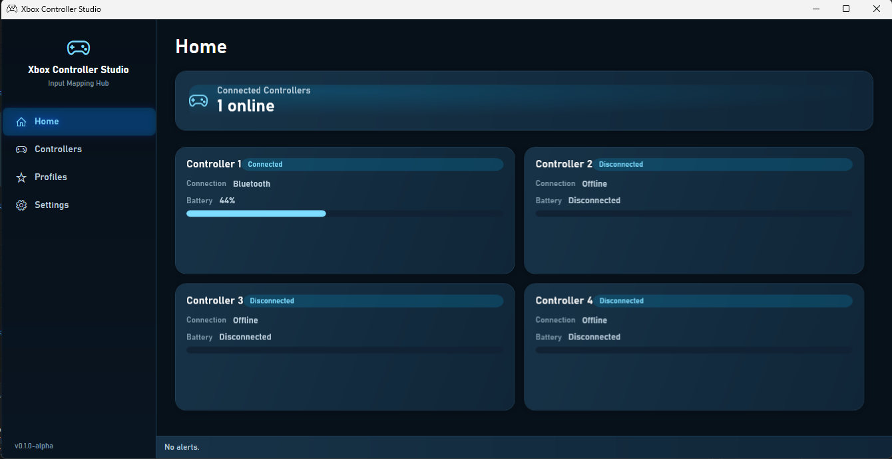
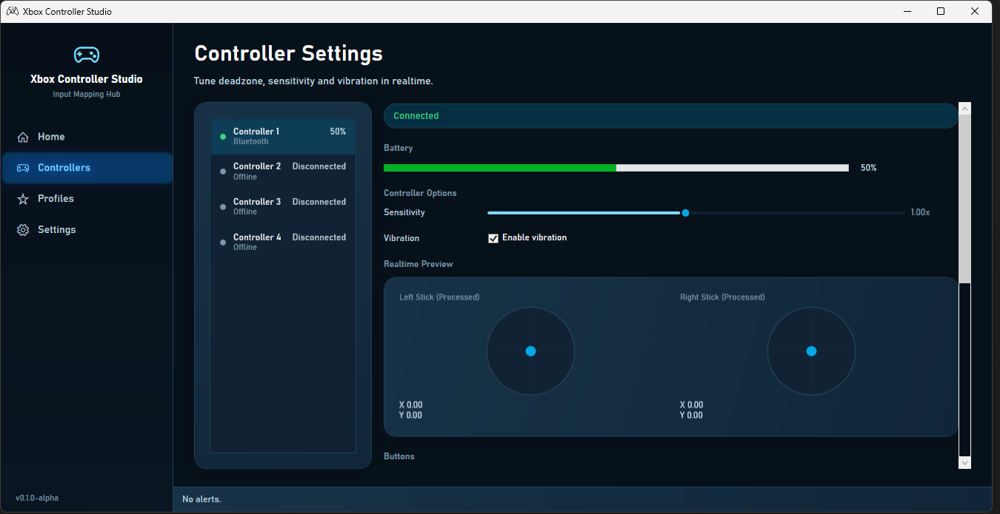
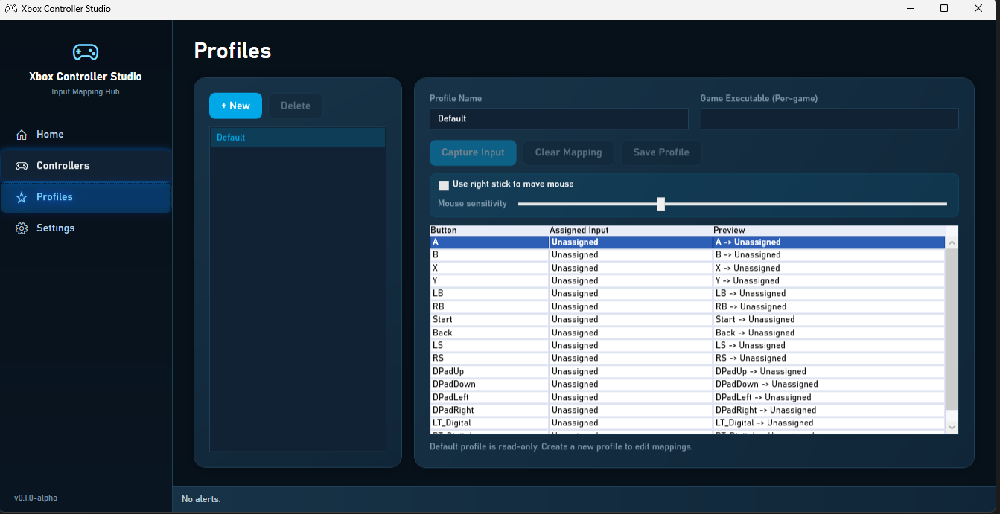
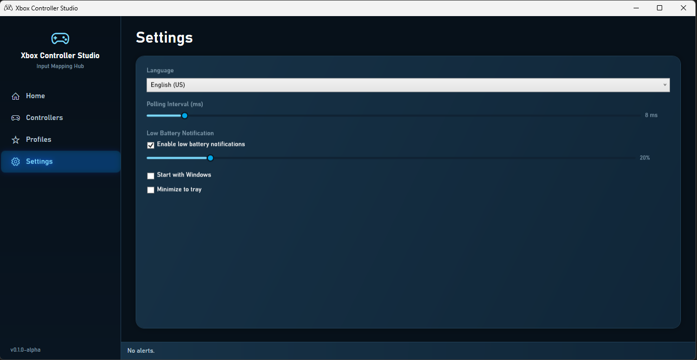

# Xbox Controller Studio

[](https://github.com/pablofleite/XboxControllerStudio/actions/workflows/release.yml)
[](https://github.com/pablofleite/XboxControllerStudio/releases)
[](https://www.microsoft.com/windows)
[](https://dotnet.microsoft.com/)
[](https://github.com/pablofleite/XboxControllerStudio)

Xbox Controller Studio is an open-source Windows desktop app for people who want full visibility and control of their Xbox controller input.

It combines real-time monitoring, battery tracking, deadzone tuning, and profile-based input mapping in a single WPF app designed for low-latency workflows.

## Why Use It

- See controller state and battery data in real time.
- Tune analog stick deadzones and sensitivity with immediate feedback.
- Map controller input to keyboard and mouse for game and productivity setups.
- Keep multiple profiles and switch quickly based on your target executable.
- Get low-battery alerts and tray integration for background usage.

## Preview

> Screenshots are expected in `/assets/images`.






## Feature Highlights

- Real-time polling powered by XInput.
- Live connection and battery status per controller slot.
- Deadzone calibration and sensitivity controls.
- Button-to-keyboard and button-to-mouse mapping.
- Optional right-stick mouse movement.
- Runtime localization with support for integrating multiple languages (currently English and Brazilian Portuguese).
- Minimize-to-tray and quick open/exit tray actions.

## Tech Stack

- C# / .NET 8
- WPF
- MVVM
- Win32 APIs (XInput and SendInput)

## Project Layout

- `Views`: WPF pages and controls.
- `ViewModels`: UI state, commands, and page logic.
- `Models`: domain and state models.
- `Services`: integrations (input, localization, polling).
- `Core`: shared infrastructure and processing logic.

## Quick Start

### Requirements

- Windows 10 or 11
- .NET SDK 8.0+

### Run Locally

```powershell
dotnet restore
dotnet build
dotnet run
```

### Build a Local Release

```powershell
dotnet publish XboxControllerStudio.csproj -c Release -r win-x64 --self-contained true /p:PublishSingleFile=true /p:IncludeNativeLibrariesForSelfExtract=true /p:PublishTrimmed=false -o publish/win-x64
```

Output: `publish/win-x64`

## Release Process

GitHub Actions builds and publishes `XboxControllerStudio-win-x64.zip` on version tags.

- Tag format: `vMAJOR.MINOR.PATCH` (example: `v1.0.0`)
- Release source: tag commit must be in `main`

```powershell
git tag v0.1.0
git push origin v0.1.0
```

## Contributing

Contributions are very welcome, especially in areas that improve reliability, UX, and input compatibility.

### Great First Contributions

- Improve edge-case battery detection and messaging.
- Add tests for deadzone and mapping processors.
- Polish keyboard/mouse mapping UX.
- Expand localization coverage and wording quality.
- Improve docs and onboarding for new contributors.

### Development Workflow

```powershell
git checkout -b feat/your-change
dotnet restore
dotnet build
dotnet run
```

When opening a PR:

- Keep changes focused and well described.
- Include screenshots or short clips for UI changes.
- Mention any behavior changes and migration notes.

## Roadmap

- [ ] Profile import/export and sharing flow
- [ ] Automated tests for core input and mapping logic
- [ ] Better Bluetooth battery reporting fallbacks
- [ ] Optional installer/package distribution
- [ ] Expanded accessibility and localization improvements

## Known Limitations

- XInput is currently the primary controller API.
- Virtual controller emulation is not included.
- Some Bluetooth battery scenarios use best-effort fallbacks.
